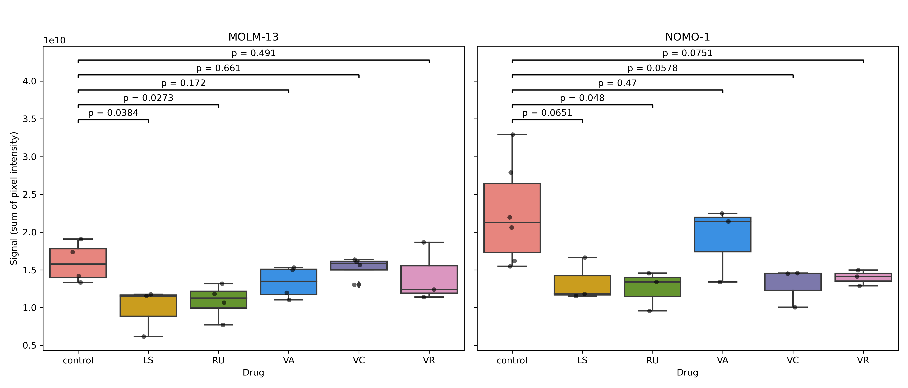

# Zebrafish Image Analysis

This repo belongs to the image analysis of (signal to noise) of zebrafish cases in project:  
[https://www.biorxiv.org/content/10.1101/2024.12.31.630711v1.abstract](https://www.biorxiv.org/content/10.1101/2024.12.31.630711v1.abstract)

## 📊 Signal Plot

